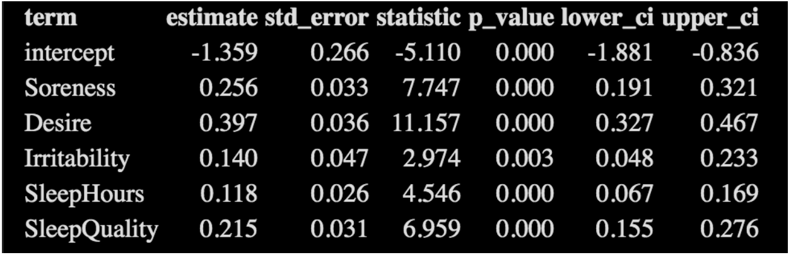
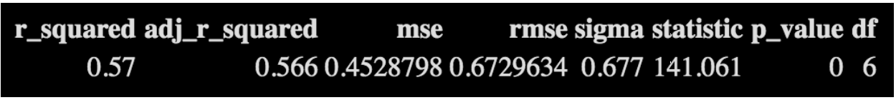

```{r include = FALSE, label = "setup"}
library(tidyverse)
library(dplyr)
library(DT)
library(MASS)
library(car)
library(ggplot2)
library(plotly)
library(moderndive)
library(caret)
library(fmsb)
library(gridExtra)
library(wordcloud2)
library(pander)
library(png)
library(grid)
```

```{r, echo = FALSE}
games <- read.csv("games.csv")
rpe <- read.csv("rpe.csv")
wellness <- read.csv("wellness.csv")

wellness <- wellness %>% 
  mutate(Pain = case_when(Pain == "Yes" ~ 1, Pain == "No" ~ 0)) %>% 
  mutate(Illness = case_when(Illness == "Slightly Off" ~ 1, Illness == "No" ~ 0)) %>%
  mutate(Menstruation = case_when(Menstruation == "Yes" ~ 1, Menstruation == "No" ~ 0))
```

```{r, echo = FALSE}
set.seed(200)
wellness_13 <- wellness %>% 
  filter(PlayerID == 13)
wellness_3 <- wellness %>%
  filter(PlayerID == 3)
wellness_15 <- wellness %>% 
  filter(PlayerID == 15)
wellness_16 <- wellness %>%
  filter(PlayerID == 16)
```

```{r, echo = FALSE, results = FALSE}
wellness_1 <- sample_n(wellness, 550, replace = FALSE, weight = NULL, .env = NULL)

selwell <- dplyr::select(wellness_1, Fatigue, Soreness, Desire, Irritability, SleepHours, SleepQuality, Pain, Illness, Menstruation)

selwell

selwell <- na.omit(selwell)

selwell <- selwell %>% 
  filter(SleepHours <= 20)

str(selwell)

slm <- lm(Fatigue ~ ., data = selwell)
summary(slm)
```


```{r, echo = FALSE, fig.width = 10, fig.height = 9}
demoFreq4 <- read.csv("demoFreq4.csv")
wordcloud2(demoFreq4, shape = 'oval', backgroundColor = "black", color=rep_len( c("red","white"), nrow(demoFreq) ), size = 0.7)
```

---

The following data is from the Canadian Rugby team. When competing at Duke in the March of 2019, we were provided this information. We decided to use the information and data provided in an attempt to find which players were the best, and how well the team performed based on the 5 variables provided in the chart below.


```{r, echo = FALSE, message = FALSE, results = "hide"}
#null <- lm(Fatigue ~ 1, data = selwell)
#full <- lm(Fatigue ~ Soreness + Desire + Irritability + SleepHours + SleepQuality, #data = selwell)

#mod.be <- stepAIC(full, scope = list(lower = null, upper = full),  direction = "backward")
#mod.fs <- stepAIC(null, scope = list(lower = null, upper = full), direction = "forward")

#summary(mod.fs)
#summary(mod.be)

#get_regression_summaries(mod.be, print = TRUE)

#get_regression_table(mod.be, print = TRUE)
```

```{r, echo = FALSE, out.width = "750px"}



```

```{r, echo = FALSE, out.width = "750px"}



```

---


```{r, echo = FALSE, message = FALSE, results = "hide", fig.width = 10, fig.height = 9}
null <- lm(Fatigue ~ 1, data = selwell)
full <- lm(Fatigue ~ Soreness + Desire + Irritability + SleepHours + SleepQuality, data = selwell)

mod.be <- stepAIC(full, scope = list(lower = null, upper = full),  direction = "backward")
mod.fs <- stepAIC(null, scope = list(lower = null, upper = full), direction = "forward")

#summary(mod.fs)
#summary(mod.be)


#par(bg = 'gray')

residualPlots(mod.be, fitted = FALSE)
```

---


```{r, echo = FALSE, results = FALSE}
#par(mfrow = c(2, 2))
#plot(mod.be)
#par(mfrow = c(1, 1))
```

```{r, echo = FALSE, results = FALSE, fig.width = 11, fig.height = 10}

#Player 13 - Dubai

par(mfrow = c(2,2))
new_rpe <- rpe %>% dplyr::filter(Date =="2017-11-30" & SessionType == "Game")
avg_rpe <- mean(new_rpe$RPE)
next_Day_wellness <- wellness %>% filter(Date =="2017-12-01" & PlayerID == "13")
next_Day_wellness <-next_Day_wellness %>% mutate(First_Day_RPE = avg_rpe)
next_Day_wellness <- next_Day_wellness %>% select(First_Day_RPE, Fatigue, Soreness, Desire, Irritability,SleepQuality)
next_Day_wellness <- rbind(rep(10,6) , rep(0,6), next_Day_wellness)
radarchart(next_Day_wellness, title = "Dubai",cglty=1, pcol = rgb(0.2,0.5,0.5,0.9) , pfcol=rgb(0.2,0.5,0.5,0.5),cglcol = "grey")
next_Day_results <- games %>% filter(Date =="2017-12-01")
dubai_whips <- games %>% filter(Tournament == "Dubai" & Date =="2017-12-01" ) 
dubai_wins <- sum(dubai_whips$Outcome == "W")/3
legend("topright",legend = c("0%", "33.33%","66.67%","100%"), col= c("red",rgb(0.2,0.5,0.5),"yellow", "purple"), title = "Winning_Percentage", box.lty=0, bty = "n", lty = 1)


#Paris
new_rpe <- rpe %>% dplyr::filter(Date =="2018-05-12" & SessionType == "Game")
avg_rpe <- mean(new_rpe$RPE)
next_Day_wellness <- wellness %>% filter(Date =="2018-05-13" & PlayerID == "13")
next_Day_wellness <-next_Day_wellness %>% mutate(First_Day_RPE = avg_rpe)
next_Day_wellness <- next_Day_wellness %>% select(First_Day_RPE, Fatigue, Soreness, Desire, Irritability,SleepQuality)
next_Day_wellness <- rbind(rep(10,6) , rep(0,6), next_Day_wellness)
radarchart(next_Day_wellness, title = "Langford",cglty=1, pcol = alpha("yellow",.9), pfcol= alpha("yellow",.5),cglcol = "grey")
next_Day_results <- games %>% filter(Date =="2018-05-13")
dubai_whips <- games %>% filter(Tournament == "Langford" & Date =="2018-05-13" ) 
paris_wins <- sum(dubai_whips$Outcome == "W")/3
legend("topright",legend = c("0%", "33.33%","66.67%","100%"), col= c("red", rgb(0.2,0.5,0.5),"yellow", "purple"), title = "Winning_Percentage", box.lty=0, bty = "n", lty = 1)

#World Cup 
new_rpe <- rpe %>% dplyr::filter(Date =="2018-07-20" & SessionType == "Game")
avg_rpe <- mean(new_rpe$RPE)
next_Day_wellness <- wellness %>% filter(Date =="2018-07-21" & PlayerID == "13")
next_Day_wellness <-next_Day_wellness %>% mutate(First_Day_RPE = avg_rpe)
next_Day_wellness <- next_Day_wellness %>% select(First_Day_RPE, Fatigue, Soreness, Desire, Irritability,SleepQuality)
next_Day_wellness <- rbind(rep(10,6) , rep(0,6), next_Day_wellness)
radarchart(next_Day_wellness, title = "World_Cup",cglty=1, pcol = rgb(0.2,0.5,0.5,0.9) ,
 pfcol=rgb(0.2,0.5,0.5,0.5),cglcol = "grey")
next_Day_results <- games %>% filter(Date =="2018-07-21")
dubai_whips <- games %>% filter(Tournament == "World Cup" & Date =="2018-07-21" ) 
world_wins <- sum(dubai_whips$Outcome == "W")/3
legend("topright",legend = c("0%", "50%", "100%"), col= c("red",rgb(0.2,0.5,0.5),"yellow"), title = "Winning_Percentage", box.lty=0, bty = "n", lty = 1)

```

